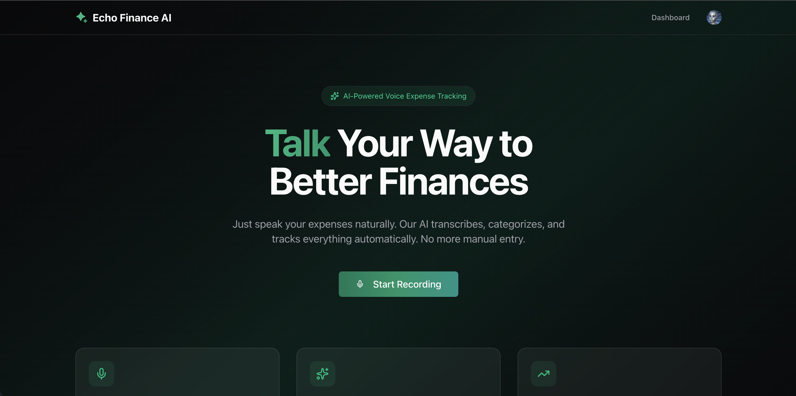
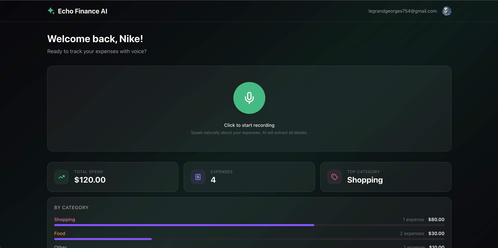
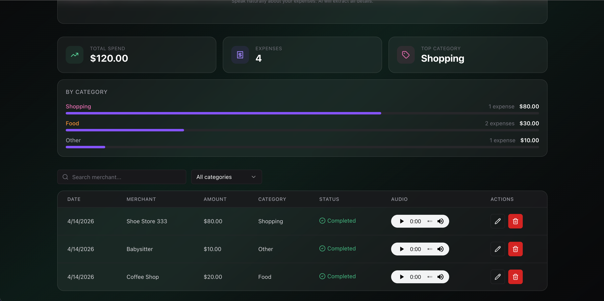

# Echo Finance AI

Record your expenses by voice. AI extracts the merchant, amount, and category automatically — no typing required. Say multiple expenses in one recording and they all get created.

---

## App Screenshots

<div align="center">
  
  <div style="display: flex; gap: 2rem;">
    
    
  </div>
</div>

---

## How it works

1. Click the microphone and say something like *"Spent $12 at Starbucks and $45 on Amazon"*
2. The audio is uploaded to Supabase Storage and an Inngest job picks it up asynchronously
3. Replicate runs OpenAI Whisper to transcribe the audio
4. Claude 3.7 Sonnet (via Replicate) extracts every expense mentioned — merchant, amount, and category
5. One expense record is created per expense detected
6. The dashboard updates automatically via polling and Supabase Realtime

---

## Tech stack

| Layer | Technology |
|-------|-----------|
| Framework | Next.js 16 (App Router) |
| Auth | Clerk |
| Database | Supabase (PostgreSQL + Realtime) |
| Storage | Supabase Storage (audio files) |
| Job queue | Inngest |
| Transcription | OpenAI Whisper via Replicate |
| AI extraction | Claude 3.7 Sonnet via Replicate |
| UI | Radix UI + Tailwind CSS v4 |
| Validation | Zod + React Hook Form |

---

## Local development

### 1. Clone and install

```bash
git clone <repo-url>
cd echo-finance-ai
pnpm install
```

### 2. Set up environment variables

```bash
cp .env.example .env.local
```

Fill in the values — see [Environment variables](#environment-variables) below.

### 3. Start the dev server

```bash
pnpm dev
```

### 4. Start the Inngest dev server (required for voice processing)

In a separate terminal:

```bash
npx inngest-cli@latest dev
```

The app runs at `http://localhost:3000`.  
Inngest runs at `http://localhost:8288` and connects automatically.

---

## Environment variables

```env
# Clerk — https://dashboard.clerk.com
NEXT_PUBLIC_CLERK_PUBLISHABLE_KEY=
CLERK_SECRET_KEY=
CLERK_WEBHOOK_SECRET=
NEXT_PUBLIC_CLERK_SIGN_IN_URL=/sign-in
NEXT_PUBLIC_CLERK_SIGN_UP_URL=/sign-up
NEXT_PUBLIC_CLERK_AFTER_SIGN_IN_URL=/dashboard
NEXT_PUBLIC_CLERK_AFTER_SIGN_UP_URL=/dashboard

# Supabase — https://supabase.com/dashboard
NEXT_PUBLIC_SUPABASE_URL=
NEXT_PUBLIC_SUPABASE_PUBLISHABLE_DEFAULT_KEY=
SUPABASE_SECRET_KEY=
SUPABASE_DB_PASSWORD=

# Inngest — https://app.inngest.com
INNGEST_EVENT_KEY=
INNGEST_SIGNING_KEY=

# Replicate — https://replicate.com (Whisper transcription + Claude extraction)
REPLICATE_API_TOKEN=
```

---

## Supabase setup

### Storage RLS policies

The `voice-recordings` bucket is private. Run the following in the Supabase SQL editor to allow the API to upload, read, and delete audio files:

```sql
create policy "Allow anon uploads"
on storage.objects for insert to anon
with check (bucket_id = 'voice-recordings');

create policy "Allow anon reads"
on storage.objects for select to anon
using (bucket_id = 'voice-recordings');

create policy "Allow anon deletes"
on storage.objects for delete to anon
using (bucket_id = 'voice-recordings');
```

### Expenses table RLS (optional — for Realtime)

To receive live updates via Supabase Realtime, the `expenses` table needs a SELECT policy for the anon role:

```sql
create policy "Allow anon select"
on public.expenses for select to anon
using (true);
```

Without this, the dashboard falls back to polling every 3 seconds while an expense is processing.

---

## Project structure

```
app/
  api/
    audio/            GET signed URL for private audio playback
    expenses/         GET list, PATCH + DELETE by id (DELETE also removes audio file)
    analytics/        GET summary stats (total spend, by category)
    voice/            POST audio — uploads to storage, triggers Inngest
    inngest/          Inngest event handler
    webhooks/clerk/   Clerk user sync webhook
  dashboard/          Main dashboard page
components/
  shared/
    ExpenseTable      Expense list — edit, delete, search, filter, polling
    ExpenseSummary    Analytics cards (total spend, top category, breakdown)
    AudioPlayer       Fetches signed URL and renders audio player per row
    ErrorBoundary     React error boundary with retry button
  voice/
    VoiceRecorder     Microphone UI — record, preview, submit
inngest/
  processVoiceExpense
    Step 1: Get signed URL for uploaded audio
    Step 2: Transcribe with Whisper via Replicate
    Step 3: Save raw transcription to DB
    Step 4: Extract all expenses with Claude 3.7 Sonnet via Replicate
    Step 5: Update original record + create additional records if multiple expenses
lib/
  supabase.ts           Supabase anon client
  replicateFactoty.ts   Replicate helpers (Whisper + Claude structured output)
  expense-schema.ts     Zod schemas for expense extraction
  inngest.ts            Inngest client
services/
  expenses.service.ts   Supabase CRUD for expenses
  storage.service.ts    Supabase Storage helpers
```

---

## Database schema

```sql
create table expenses (
  id          uuid primary key default gen_random_uuid(),
  user_id     text not null,
  merchant    text,
  amount      numeric,
  category    text, -- food | transport | shopping | entertainment
                    -- bills | health | education | travel | other
  status      text default 'pending', -- pending | processing | completed | error
  raw_text    text,
  audio_url   text,
  created_at  timestamptz default now(),
  updated_at  timestamptz default now()
);
```

Row Level Security is enabled — users can only write their own rows.
